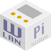

Title: WLAN Pi Web GUI
Authors: Nigel Bowden

# Welcome to the WLAN Pi GUI

This GUI currently provides access to a subset of the many features available on the WAN Pi. Over the next few releases of WLAN Pi code, we will be adding new features to this GUI to ensure that all functionality available via the front panel buttons will be available here. We will also be adding with a whole new range of features that we have in the pipeline.

!!! info
    Check out our online [documentation pages][docs] to find out more about using the WLAN Pi.

<!-- Link list -->
[docs]: https://wlan-pi.github.io/wlanpi-documentation/
